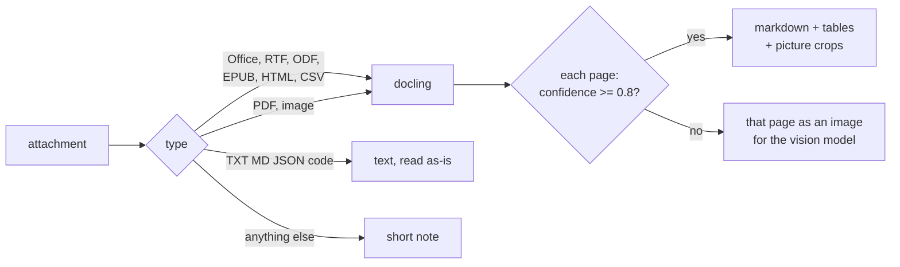
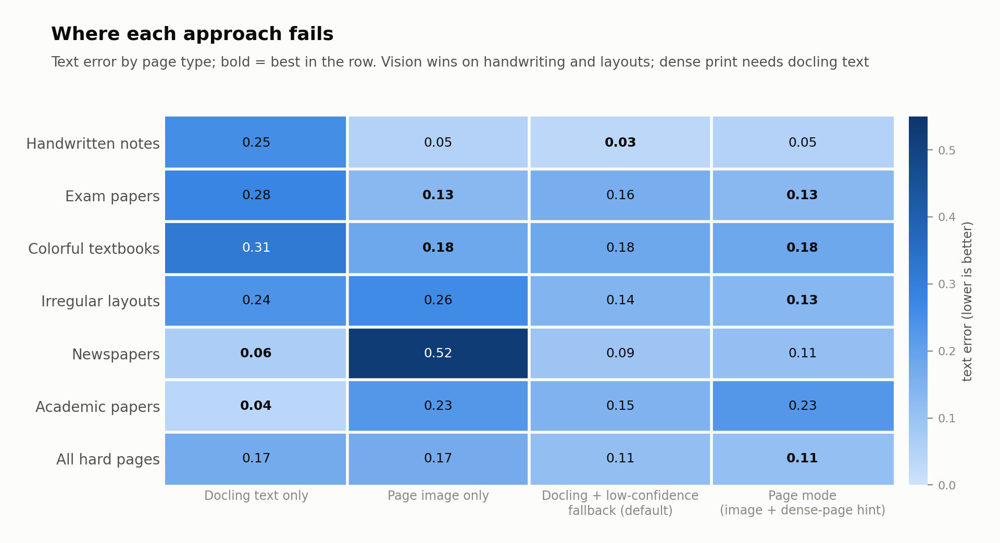
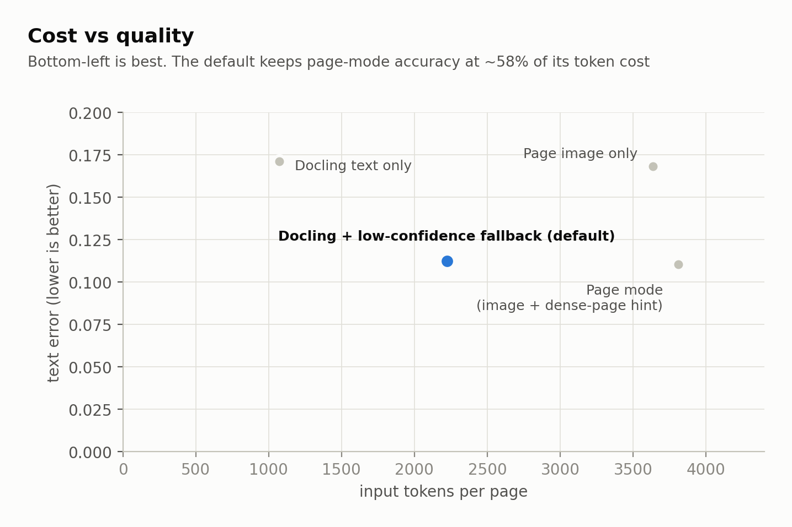
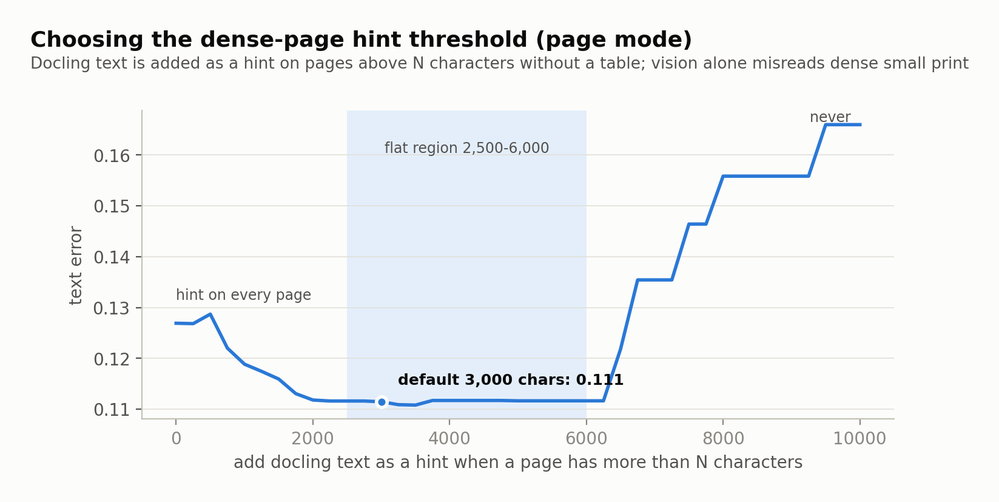
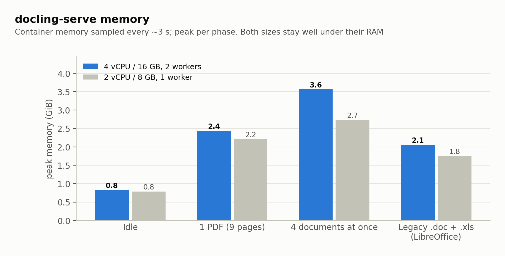
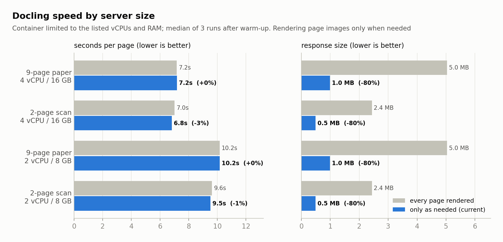

# ai-sdk-docling

Middleware for the [Vercel AI SDK](https://ai-sdk.dev) that turns any chat attachment into what a vision
LLM reads best, using a self-hosted [docling-serve](https://github.com/docling-project/docling-serve).
Text and tables come from docling; pictures, handwriting and hard layouts go to the model as images - and
only when docling isn't confident, which keeps token cost down.

Every routing rule below was measured on [OmniDocBench](https://github.com/opendatalab/OmniDocBench), not guessed.

**Contents:** [Why](#why) · [How it works](#how-it-works) · [Supported documents](#supported-documents) ·
[Usage](#usage) · [Configuration](#configuration) · [Results](#results) · [Deployment](#deployment) ·
[Limitations](#limitations) · [Development](#development)

## Why

- **OpenAI's AI SDK provider throws on any file that isn't a PDF or an image** - a `.docx`, `.txt` or `.xlsx`
  attachment fails the whole chat request. This middleware converts every attachment into parts the model accepts.
- **Docling and vision models fail on different pages.** Docling's text is near-perfect on clean documents and
  poor on handwriting and irregular layouts; vision is the opposite, and misreads dense small print.
- **Docling reports its own confidence**, so the expensive path (images) is used only where it pays off.

## How it works



Docling reads the layout, reading order and tables of **every** page. Its per-page confidence only decides which pages
it read unreliably (scans, handwriting): those pages - and only those - go to the vision model as images. If every
page is low, the original PDF goes instead.

Every document is wrapped as `<document name="..." confidence="0.86">` (the worst page), so the model knows where each file starts
and how far to trust the extracted text. Charts, maps and diagrams keep full image detail; logos and icons are dropped.

## Supported documents

| Format | Media types | The model receives |
|---|---|---|
| PDF | `application/pdf` | text + tables + picture crops; below `minConfidence`, the original PDF |
| PNG, JPEG, WEBP | `image/png` `image/jpeg` `image/webp` | text + picture crops; below `minConfidence` (e.g. photos), the original image |
| GIF | `image/gif` | the original image (docling doesn't read GIF) |
| TIFF, BMP (incl. multi-page TIFF) | `image/tiff` `image/bmp` | one PNG per page (the model can't read TIFF/BMP) |
| Word | DOCX, DOC | markdown, lists, tables (merged cells), embedded pictures, page header/footer once |
| PowerPoint | PPTX, PPT | `[slide N]` markers, titles, bullets, tables, **speaker notes**, **chart data as tables**, pictures |
| Excel | XLSX, XLS | `## Sheet: name` + a table per data block, **chart data as tables** |
| OpenDocument | ODT, ODS, ODP | markdown, tables |
| RTF, EPUB, HTML/XHTML, CSV, AsciiDoc | `application/rtf` `application/epub+zip` `text/html` `text/csv` `text/asciidoc` | markdown, tables |
| Plain text | `text/*`, `application/json` `xml` `yaml` `toml` `javascript` `typescript` `sql` ... | the text itself, capped at `maxTextChars` |
| Anything else (audio, video, email, archives) | - | a one-line note, so the request never fails |

DOC, PPT, XLS and RTF are converted through LibreOffice, which the image in `server/` adds.

A mixed PDF - one clean page, one handwritten page - arrives as:
```
<document name="mixed.pdf" confidence="0.79">
[page 1, confidence 0.94]
Here is what Docling delivers today: ...   <- docling text
[page 2, confidence 0.79]
<image/png part>                     <- the page image, for the vision model
</document>
```

<details>
<summary>What the model receives - real output for each type</summary>

**DOCX** - headings, tables and embedded pictures in reading order:
```
<document name="report.docx">
## Quarterly Report

Revenue grew 12% to 4.2M. The CEO is pictured below.

[image 1 (photograph)]
<image/png part, 104 KB>
Figure 1: Alan Turing, founder.

|Region|Sales|
|-|-|
|EU|1.9M|
|US|2.3M|
</document>
```

**PPTX** - slide numbers, speaker notes, the chart's own data:
```
[slide 1]
# Roadmap 2026
Product planning
Notes: Speaker note: open with the Q3 numbers.
...
[slide 4]
# Sales chart
[chart (bar chart)]
||Sales|
|-|-|
|North|42|
|South|17|
```

**XLSX** - sheet names, tables, chart data:
```
<document name="sales.xlsx">
## Sheet: Sales
|Region|Q1|Q2|
|-|-|-|
|EU|1900000|2100000|
[chart (bar chart): Revenue chart]
...
## Sheet: Notes
|Figures in USD, unaudited.|
</document>
```

**DOC** (legacy Word, via LibreOffice):
```
<document name="budget.doc">
## Budget

Planned spend by region.

|Region|Budget|
|-|-|
|EU|1.9M|
|US|2.3M|

Approved in March.
</document>
```

**Scanned PDF**, confident (0.86) - OCR text with the photos as image parts:
```
<document name="scan.pdf" confidence="0.86">
## Alan Turing

Alan Mathison Turing (23 June 1912 - 7 June 1954) was an English mathematician, computer scientist ...
<image/png part, 104 KB>
Born ... 23 June 1912 Maida Vale, London, England ...
</document>
```

**Photo** - nothing to extract (confidence 0.00), so the model gets the image itself:
```
<document name="person.png" confidence="0.00">
<image/png part, 104 KB>
</document>
```

**Multi-page TIFF** - one PNG per page:
```
<document name="fax.tiff" confidence="0.85">
[page 1]
<image/png part>
[page 2]
<image/png part>
</document>
```

**Markdown** - read directly, no docling:
```
<document name="notes.md">
# Notes

Quarterly revenue grew 12 percent. EU sales were 1.9M.
</document>
```

**Unsupported type**:
```
[attachment "clip.mp4": this file type (video/mp4) can't be read]
```

</details>

### Pictures: charts, photos, people

Docling reads text; it doesn't understand pictures. It finds each one, crops it, labels its type and attaches its
caption - the vision model then reads the picture itself:

```
[image 3 (line chart): Figure 5: Prediction performance ... | text in image: 70 | mAP 0.50:0.95 | 65 | ... | % of DocLayNet training set | 20 | 40 | 60 | 80 | 100]
<image/png part>
```

- **Charts, diagrams, maps, tables drawn as images** go at full detail, with the text docling read inside them
  (axis labels, values, box labels) - the model sees the shape and gets the exact numbers in writing.
- **Photos and landscapes** go as images at low detail by default (cheap). Their OCR text is left out (noise).
- **People:** vision models describe people but won't identify them from their face. The caption and surrounding
  text carry the name, so they are always placed next to the image.
- **Over `maxImages`**, the most informative pictures are kept (charts, diagrams, tables, then others, photos last;
  larger first). The rest become a line with their type, caption and inner text.

### Compared with other parsers

Same documents, same scoring - full details, heatmaps and fairness notes in **[docs/COMPARISON.md](docs/COMPARISON.md)**.

| | This project | docling alone | PyMuPDF4LLM | MarkItDown + OCR plugin |
|---|---|---|---|---|
| Hard pages: text error (lower is better) | **0.112** | 0.171 | 0.311 | 0.166 |
| Hard pages: table accuracy, TEDS | **79.1** | 68.6 | 35.0 | 0.0 |
| Hard pages sent to an LLM | 40% | 0% | 0% | 100% |
| Word / PowerPoint / Excel checks (21) | **21** | - | 9 | 17 |
| Digital 9-page PDF, 4 vCPU | 64 s | 64 s | 28 s | 185 s |
| License | MIT | MIT | AGPL | MIT |

For trusted digital PDFs where speed matters most, `pdf: 'native'` skips docling entirely.

## Usage

### 1. Install and start docling-serve

```bash
npm install ai-sdk-docling   # peer dependencies: ai@7, @ai-sdk/provider@4
```

The docling-serve image (`server/`, `docker-compose.yml`) is in this repository:

```bash
cp .env.example .env
dotenvx set DOCLING_API_KEY "$(openssl rand -hex 24)"
dotenvx run -- docker compose up -d --build
```

### 2. Wrap your model (server-side)

The middleware always runs on your server, wrapping the model. Create it once at module scope so its cache is
shared across requests. Two ways to call it:

**A. Chat app** - an API route that receives messages from `useChat` in the browser:

```ts
// app/api/chat/route.ts (server)
import { openai } from '@ai-sdk/openai';
import { convertToModelMessages, streamText, wrapLanguageModel } from 'ai';
import { doclingAttachments, noServerDownloads } from 'ai-sdk-docling';

const model = wrapLanguageModel({
  model: openai('gpt-5-mini'),
  middleware: doclingAttachments({ url: process.env.DOCLING_URL!, apiKey: process.env.DOCLING_API_KEY }),
});

export async function POST(req: Request) {
  const { messages } = await req.json();
  return streamText({
    model,
    messages: await convertToModelMessages(messages),
    experimental_download: noServerDownloads, // never fetch user-supplied URLs server-side (SSRF)
  }).toUIMessageStreamResponse();
}
```

The client needs no change: `useChat` already sends every attachment to this route as a data URL, and the route
converts it before the model sees it.

**B. Server-only** - files you already have (background jobs, scripts, other APIs), no chat UI involved:

```ts
import { readFile } from 'node:fs/promises';
import { generateText } from 'ai';

const { text } = await generateText({
  model, // the same wrapped model
  experimental_download: noServerDownloads,
  messages: [{
    role: 'user',
    content: [
      { type: 'text', text: 'Summarize this contract and list every deadline.' },
      { type: 'file', data: await readFile('contract.docx'), filename: 'contract.docx',
        mediaType: 'application/vnd.openxmlformats-officedocument.wordprocessingml.document' },
    ],
  }],
});
```

### Presets

```ts
const base = { url: process.env.DOCLING_URL!, apiKey: process.env.DOCLING_API_KEY };

// Hybrid (default) - best overall: docling reads layout, text and tables on every page; pictures (charts,
// photos, diagrams) go to the vision model as images with their caption and inner text; pages docling reads
// unreliably (confidence < 0.8: handwriting, bad scans) go as page images. Lowest text error, 40% of pages to the LLM.
doclingAttachments(base);

// Page mode - best tables and reading order, ~1.7x the tokens: every PDF page and image goes as an image,
// plus docling's text on dense pages
doclingAttachments({ ...base, pdf: 'pages', images: 'pages' });

// Lowest cost: text only; pictures become caption lines (a photo uploaded on its own still goes through)
doclingAttachments({ ...base, minConfidence: 0, maxImages: 0 });

// Fastest: skip docling for PDFs and images, keep it for Office/other formats
doclingAttachments({ ...base, pdf: 'native', images: 'native' });

// A model that reads images but not PDFs: PDFs are always parsed; low confidence -> page images
doclingAttachments({ ...base, nativeTypes: ['image/png', 'image/jpeg', 'image/webp', 'image/gif'] });

// Expensive main model: let a capable, cheaper model read images and low-confidence pages into text
// (the main model receives text only). Not needed when the main model is gpt-5-mini - it reads them itself.
doclingAttachments({ ...base, visionModel: openai('gpt-5-mini') });
```

## Configuration

| Option | Default | |
|---|---|---|
| `url`, `apiKey` | - | docling-serve address and API key |
| `pdf` | `'docling'` | `'docling'` text + fallback · `'pages'` page images (best tables, most tokens) · `'native'` no docling |
| `images` | `'docling'` | same three modes for image attachments |
| `minConfidence` | `0.8` | below it the original file goes to the vision model; `0` = never |
| `imageDetail` | `'low'` | detail for photos, signatures and stamps only; charts, diagrams, tables and page images always stay full detail |
| `denseChars` | `3000` | page mode: add docling text next to the image on pages with more text than this |
| `maxImages` | `10` | pictures sent per document - charts, diagrams and tables first, photos last; the rest become a caption line |
| `pictureTextChars` | `600` | text docling reads inside a chart/diagram/table image, sent next to it; `0` = off |
| `skipClasses` | `['logo', 'icon']` | picture types never sent |
| `minImagePx` | `48` | smaller pictures are dropped |
| `maxPages` | `100` | pages parsed per PDF; the model is told when a document was cut |
| `maxPageImages` | `20` | page mode: later pages go as text |
| `maxFileBytes` | 50 MB | larger files pass through (PDF, images) or get a note |
| `maxTextChars` | 200,000 | cap for plain-text attachments |
| `timeoutMs` | 15 min | per document, including docling's queue |
| `cacheMB` | 256 | in-process cache keyed by file hash (chat history re-sends files every turn) |
| `nativeTypes` | OpenAI's | media types the model accepts directly |
| `fetchUrls` | `false` | download `http(s)` file URLs server-side (off: SSRF risk) |
| `visionModel` | - | a separate model that turns images and fallback pages into text; the main model gets text only. Use a capable one: on the 88 hard pages gpt-5-mini scored 0.168 text error, gpt-5-nano 0.503 (worse than docling alone) |
| `visionPrompt` | built-in | instruction for `visionModel` (transcribe text and tables exactly, chart values, short photo description) |
| `doclingTypes` | `DOCLING_TYPES` | media types docling parses, mapped to the file extension docling needs |
| `plainTextTypes` | `isPlainTextType` | which media types are read as plain text |
| `doclingOptions` | - | extra [docling-serve convert options](https://github.com/docling-project/docling-serve/blob/main/docs/usage.md), e.g. `{ ocr_lang: ['en', 'de'] }` |
| `onError` | `console.warn` | receives parse errors (the model only gets a generic note) |

All defaults are exported as `DEFAULTS`, and the type tables as `DOCLING_TYPES`, `OPENAI_NATIVE_TYPES` and
`isPlainTextType`, so limits and supported types can be changed without copying them:

```ts
import { DOCLING_TYPES, doclingAttachments, isPlainTextType, OPENAI_NATIVE_TYPES } from 'ai-sdk-docling';

doclingAttachments({
  ...base,
  // limits
  maxFileBytes: 20 * 2 ** 20,
  maxPages: 30,
  maxImages: 5,
  // a model that also reads audio: pass it through
  nativeTypes: [...OPENAI_NATIVE_TYPES, 'audio/wav'],
  // don't parse HTML; read it as plain text instead
  doclingTypes: Object.fromEntries(Object.entries(DOCLING_TYPES).filter(([t]) => t !== 'text/html')),
  plainTextTypes: (t) => isPlainTextType(t) || t === 'application/x-ndjson',
  // docling OCR languages
  doclingOptions: { ocr_lang: ['en', 'de'] },
});
```

The lower-level pieces are exported too: `convertWithDocling` (the docling-serve client), `doclingToBlocks`,
`pageBlocks` and `pageText` (DoclingDocument -> text and image blocks), with TypeScript types for each.

## Results

88 hard OmniDocBench pages (handwriting, tables, charts, irregular layouts, newspapers), read by `gpt-5-mini`.


The default reaches page-mode text accuracy; page mode is still best for tables and reading order.



Neither source wins everywhere - docling is best on clean and dense print, vision on handwriting and layouts.
Routing by confidence takes the better one per page.



<details>
<summary>How the thresholds were chosen</summary>


Docling's `low_score` ranged 0.67-0.96 on these pages; all pages where docling failed scored 0.85 or lower.
At 0.8, 40% of hard pages go to the model as images - clean documents score higher and stay text.



In page mode, docling's text is added next to the image only on dense pages without tables. Anywhere between
2,500 and 6,000 characters gives the same result.

</details>

## Deployment

The image is the official docling-serve CPU release (`v1.35.0`) plus LibreOffice, with a one-line build patch that
returns docling's per-page confidence (docling computes it; docling-serve only returned the document score). Size workers x threads to
the machine's vCPUs with `DOCLING_WORKERS` and `DOCLING_THREADS`:

| Server | Workers x threads | Speed (measured) | Memory, idle / peak (measured) |
|---|---|---|---|
| 4 vCPU / 16 GB | 2 x 2 (default) | ~7 s per page, 2 documents in parallel | 0.8 GB / 3.6 GB |
| 2 vCPU / 8 GB | 1 x 2 | ~10 s per page, 1 document at a time | 0.8 GB / 2.7 GB |

The first conversion adds about 1.5 GB, each further parallel conversion about 1 GB; between requests memory
stays around 2 GB (the models stay loaded). 8 GB leaves room for long documents on either size.





Processing time is set by docling's models (layout, OCR, tables) and the vCPUs. Page images are rendered only
when a page needs one, which cuts each response by 80%; plain-text files skip docling entirely.

- **Avoid burstable CPU for steady traffic.** Sustained conversion drains CPU credits, after which a burstable
  instance runs at a fraction of its vCPUs. Use unlimited-credit mode or a fixed-performance instance.
- **ECS/Fargate:** build the image (`docker compose build`), push it to ECR, give the task the vCPU and memory
  above, and pass `DOCLING_API_KEY` from Secrets Manager. Keep the service in a private subnet; only the app
  should reach port 5001.
- **Security:** API key required, port bound to localhost, no outbound calls from docling, file/page/queue caps.
  The middleware never downloads user URLs and never shows internal errors to the model.
- **App memory:** the middleware caches parsed documents in-process (`cacheMB`, 256 MB). With more than one app
  instance, move the cache to Redis or blob storage (same sha256 key).

## Limitations

- Docling on CPU takes seconds per page; long PDFs are cut at `maxPages`.
- The threshold (0.8) was calibrated on single pages; multi-page documents are routed page by page.
- With `visionModel`, the main model reads a transcription of each image rather than seeing it. Pick a capable
  vision model - a weak one (gpt-5-nano measured 3x worse than gpt-5-mini) makes results worse than no fallback.
- Audio, video and email are out of scope (the model gets a note).

## Development

```
src/      the package: middleware, docling-serve client, document -> blocks, cache
test/     unit (offline) and integration (live docling-serve, optional OpenAI) tests, with fixtures
server/   the docling-serve image (release + LibreOffice + per-page confidence patch)
bench/    benchmark scripts and charts; see bench/README.md
docs/     the parser comparison and chart images
```

```bash
npm install
npm run typecheck
npm test                                        # offline
dotenvx run -- npm run test:integration         # needs docling-serve; OPENAI_API_KEY adds one real call
npm run build                                   # dist/, what is published
```

Tests run TypeScript directly with Node's built-in type stripping (Node 22.18+ / 24); the published package is
compiled JavaScript with type declarations and runs on Node 20+.
