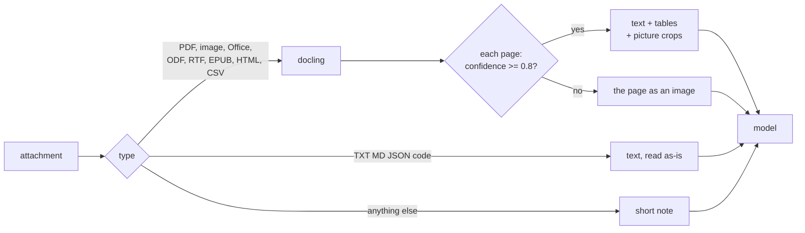
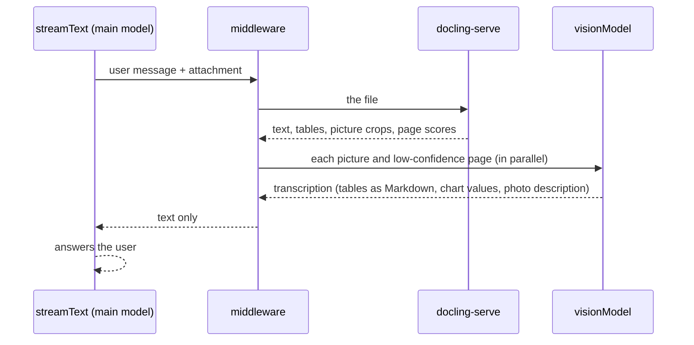

# ai-sdk-docling

Chat attachments that any LLM can read. A [Vercel AI SDK](https://ai-sdk.dev) middleware that parses every
attachment - PDFs, scans, Word, PowerPoint, Excel, images - with a self-hosted
[docling-serve](https://github.com/docling-project/docling-serve), and sends the vision model only what OCR
can't read: pictures, handwriting and badly scanned pages.

- **No failed requests.** OpenAI's AI SDK provider throws on any file that isn't a PDF or an image; a `.docx` or
  `.xlsx` attachment fails the whole chat. Every attachment here becomes text and image parts the model accepts.
- **OCR for text, vision for the rest.** Docling reads layout, text and tables; charts and photos go to the model
  as images; pages docling can't read reliably go as page images. Docling reports its own confidence, so the
  expensive path is only taken where it pays off.
- **Measured, not guessed.** Every rule was tuned on [OmniDocBench](https://github.com/opendatalab/OmniDocBench)
  and compared with other parsers ([docs/COMPARISON.md](docs/COMPARISON.md)).

| 88 hard pages (handwriting, tables, charts, layouts) | This project | docling alone | PyMuPDF4LLM | MarkItDown + OCR |
|---|---|---|---|---|
| Text error (lower is better) | **0.112** | 0.171 | 0.311 | 0.166 |
| Table accuracy, TEDS (higher is better) | **79.1** | 68.6 | 35.0 | 0.0 |
| Pages sent to an LLM | 40% | 0% | 0% | 100% |

**Contents:** [Quick start](#quick-start) · [How it works](#how-it-works) · [Choosing models](#choosing-models) ·
[Presets](#presets) · [Configuration](#configuration) · [Supported documents](#supported-documents) ·
[Results](#results) · [Deployment](#deployment) · [Limitations](#limitations) · [Development](#development)

## Quick start

**1. Install**

```bash
npm install ai-sdk-docling   # peer dependencies: ai@7, @ai-sdk/provider@4
```

**2. Start docling-serve** (the image in this repository: the official release plus LibreOffice and per-page
confidence). Needs Docker and [dotenvx](https://dotenvx.com) for the key:

```bash
cp .env.example .env
dotenvx set DOCLING_API_KEY "$(openssl rand -hex 24)"
dotenvx run -- docker compose up -d --build
```

**3. Wrap your model** in the chat route. The middleware runs on your server; create it once at module scope so
its cache is shared across requests.

```ts
// app/api/chat/route.ts
import { openai } from '@ai-sdk/openai';
import { convertToModelMessages, streamText, wrapLanguageModel } from 'ai';
import { doclingAttachments, noServerDownloads } from 'ai-sdk-docling';

const model = wrapLanguageModel({
  model: openai('gpt-5-mini'),
  middleware: doclingAttachments({ url: process.env.DOCLING_URL!, apiKey: process.env.DOCLING_API_KEY }),
});

export async function POST(req: Request) {
  const { messages } = await req.json();
  return streamText({
    model,
    messages: await convertToModelMessages(messages),
    experimental_download: noServerDownloads, // never fetch user-supplied URLs server-side (SSRF)
  }).toUIMessageStreamResponse();
}
```

The client needs no change: `useChat` already sends attachments to this route as data URLs.

The same wrapped model works without a chat UI - background jobs, scripts, other APIs:

```ts
import { readFile } from 'node:fs/promises';
import { generateText } from 'ai';

const { text } = await generateText({
  model, // the same wrapped model
  experimental_download: noServerDownloads,
  messages: [{
    role: 'user',
    content: [
      { type: 'text', text: 'Summarize this contract and list every deadline.' },
      { type: 'file', data: await readFile('contract.docx'), filename: 'contract.docx',
        mediaType: 'application/vnd.openxmlformats-officedocument.wordprocessingml.document' },
    ],
  }],
});
```

## How it works



The default is a hybrid, decided page by page:

1. **Docling reads every page** - layout, reading order, text, tables (as Markdown, merged headers kept).
2. **Pictures go to the vision model as images.** Docling crops each chart, diagram, photo or map, labels its type
   and attaches its caption and the text it read inside it, so a chart arrives with its exact numbers in writing.
   Logos and icons are dropped; photos go at low detail (cheap), charts at full detail.
3. **Pages docling reads unreliably go as images.** Docling scores each page (OCR + layout, 0-1). Below
   `minConfidence` (0.8) - handwriting, bad scans - that page goes to the model as an image instead of docling's
   text. Only that page: the rest of the document stays text. If every page is low, the original PDF goes instead.

Each attachment is wrapped as `<document name="..." confidence="0.86">` (the worst page's score), so the model knows
where each file starts and how far to trust its text. A mixed PDF - one clean page, one handwritten page - arrives as:

```
<document name="mixed.pdf" confidence="0.79">
[page 1, confidence 0.94]
Here is what Docling delivers today: ...   <- docling text
[page 2, confidence 0.79]
<image/png part>                           <- the page image, for the vision model
</document>
```

Parsed documents are cached by content hash: chat history re-sends every attachment each turn, but each file is
parsed once.

## Choosing models

**One model (default).** The model you pass to `streamText` receives the text and the images and reads both. It
must accept images (and PDFs, for the all-pages-low fallback). With `gpt-5-mini` this is the best setup measured.

**A separate vision model.** Set `visionModel` and the middleware sends every image and fallback page to that model
first, and replaces it with the model's transcription. The model in `streamText` then receives **text only**:



```ts
const model = wrapLanguageModel({
  model: openai('gpt-5'),                       // main model: reasoning and the answer; sees text only
  middleware: doclingAttachments({
    url: process.env.DOCLING_URL!,
    apiKey: process.env.DOCLING_API_KEY,
    visionModel: openai('gpt-5-mini'),          // reads images and low-confidence pages into text
  }),
});

streamText({ model, messages }); // unchanged
```

Any two AI SDK models work, from any providers - the main model can even be text-only. Use it when:

- **the main model is expensive**: image tokens are billed at the vision model's price instead, or
- **the main model can't read images or PDFs** at all.

Trade-offs: the main model reads a description of each picture instead of seeing it, and one extra model call is
made per image (in parallel, cached by content hash, so history turns cost nothing). Pick a capable vision model:
on the hard pages `gpt-5-mini` scored 0.168 text error, `gpt-5-nano` 0.503 - worse than docling alone. The
instruction it gets is `visionPrompt`.

When the main model is `gpt-5-mini`, don't set `visionModel`: it reads the images itself, for less.

## Presets

```ts
const base = { url: process.env.DOCLING_URL!, apiKey: process.env.DOCLING_API_KEY };

doclingAttachments(base);                                        // hybrid (default)
doclingAttachments({ ...base, pdf: 'pages', images: 'pages' });  // page mode
doclingAttachments({ ...base, minConfidence: 0, maxImages: 0 }); // docling text only
doclingAttachments({ ...base, pdf: 'native', images: 'native' }); // no docling for PDFs and images
```

| Preset | Text error | Reading order | Tables (TEDS) | Input tokens / page | Use when |
|---|---|---|---|---|---|
| **Hybrid** (default) | **0.112** | 0.242 | 79.1 | ~2.2K | general use: best text at 40% of pages as images |
| Page mode | 0.111 | **0.217** | **86.3** | ~3.8K | tables and complex layouts matter most |
| Docling text only | 0.171 | 0.349 | 68.6 | ~1.1K | lowest cost; pictures become caption lines |
| Native | - | - | - | provider's | trusted digital PDFs, speed first; Office files still use docling |

Measured on the 88 hard pages with `gpt-5-mini`. In page mode every PDF page and image goes as an image, plus
docling's text on dense pages without tables (vision alone misreads small print). A photo uploaded on its own always
reaches the model, whatever the preset.

## Configuration

`doclingAttachments(options)` - only `url` is required.

**What goes where**

| Option | Default | |
|---|---|---|
| `pdf` | `'docling'` | `'docling'` hybrid · `'pages'` page images · `'native'` the provider reads the PDF |
| `images` | `'docling'` | the same three modes for image attachments |
| `minConfidence` | `0.8` | pages below this docling confidence go as images; `0` = never |
| `visionModel` | - | a separate model that turns images into text ([Choosing models](#choosing-models)) |
| `visionPrompt` | built-in | its instruction: exact text and tables, chart values, short photo description |

**Pictures**

| Option | Default | |
|---|---|---|
| `maxImages` | `10` | pictures per document - charts, diagrams and tables first, photos last; the rest become a caption line |
| `imageDetail` | `'low'` | detail for photos, signatures and stamps; charts, tables and pages always full detail |
| `pictureTextChars` | `600` | text docling read inside a chart or diagram, sent next to it; `0` = off |
| `skipClasses` | `['logo', 'icon']` | picture types never sent |
| `minImagePx` | `48` | smaller pictures are dropped |

**Limits**

| Option | Default | |
|---|---|---|
| `maxFileBytes` | 50 MB | larger files pass through (PDF, images) or get a note |
| `maxPages` | `100` | pages parsed per document; the model is told when a document was cut |
| `maxPageImages` | `20` | page images per document; later pages go as text |
| `maxTextChars` | 200,000 | cap for plain-text attachments |
| `denseChars` | `3000` | page mode: pages with more text than this also get docling's text |
| `timeoutMs` | 15 min | per document, including docling's queue |
| `cacheMB` | `256` | in-process cache of parsed documents |

**File types and docling**

| Option | Default | |
|---|---|---|
| `nativeTypes` | `OPENAI_NATIVE_TYPES` | media types the model accepts as-is (PDF, PNG, JPEG, WEBP, GIF) |
| `doclingTypes` | `DOCLING_TYPES` | media types docling parses, mapped to the extension docling needs |
| `plainTextTypes` | `isPlainTextType` | media types read as plain text |
| `doclingOptions` | - | extra [docling-serve options](https://github.com/docling-project/docling-serve/blob/main/docs/usage.md), e.g. `{ ocr_lang: ['en', 'de'] }` |
| `fetchUrls` | `false` | download `http(s)` file URLs server-side (off: SSRF risk) |
| `onError` | `console.warn` | receives parse errors; the model only gets a generic note |

Every default is exported as `DEFAULTS`, and the type tables as `DOCLING_TYPES`, `OPENAI_NATIVE_TYPES` and
`isPlainTextType`, so they can be extended rather than copied:

```ts
import { DOCLING_TYPES, doclingAttachments, isPlainTextType, OPENAI_NATIVE_TYPES } from 'ai-sdk-docling';

doclingAttachments({
  ...base,
  maxFileBytes: 20 * 2 ** 20,
  maxPages: 30,
  maxImages: 5,
  // a model that also reads audio: pass it through
  nativeTypes: [...OPENAI_NATIVE_TYPES, 'audio/wav'],
  // don't parse HTML; read it as plain text instead
  doclingTypes: Object.fromEntries(Object.entries(DOCLING_TYPES).filter(([t]) => t !== 'text/html')),
  plainTextTypes: (t) => isPlainTextType(t) || t === 'application/x-ndjson',
  doclingOptions: { ocr_lang: ['en', 'de'] },
});

// a model that reads images but not PDFs: PDFs are always parsed; low-confidence pages go as page images
doclingAttachments({ ...base, nativeTypes: ['image/png', 'image/jpeg', 'image/webp', 'image/gif'] });
```

The lower-level pieces are exported with TypeScript types: `convertWithDocling` (the docling-serve client),
`doclingToBlocks`, `pageBlocks` and `pageText` (a DoclingDocument -> text and image blocks).

## Supported documents

| Format | The model receives |
|---|---|
| PDF | text + tables + picture crops; low-confidence pages as images; all pages low: the original PDF |
| PNG, JPEG, WEBP | text + picture crops; low confidence (e.g. a photo): the original image |
| GIF | the original image (docling doesn't read GIF) |
| TIFF, BMP, multi-page TIFF | one PNG per page |
| Word (DOCX, DOC) | Markdown, lists, tables with merged cells, pictures, page header/footer once |
| PowerPoint (PPTX, PPT) | `[slide N]` markers, bullets, tables, **speaker notes**, **chart data as tables**, pictures |
| Excel (XLSX, XLS) | `## Sheet: name` + a table per data block, **chart data as tables** |
| OpenDocument (ODT, ODS, ODP), RTF, EPUB, HTML, CSV, AsciiDoc | Markdown, tables |
| Plain text: `text/*`, JSON, XML, YAML, TOML, code | the text itself, up to `maxTextChars` |
| Anything else (audio, video, email, archives) | a one-line note, so the request never fails |

DOC, PPT, XLS and RTF go through LibreOffice, which the image in `server/` adds.

<details>
<summary>What the model receives - real output for each type</summary>

**DOCX** - headings, tables and embedded pictures in reading order:
```
<document name="report.docx">
## Quarterly Report

Revenue grew 12% to 4.2M. The CEO is pictured below.

[image 1 (photograph)]
<image/png part, 104 KB>
Figure 1: Alan Turing, founder.

|Region|Sales|
|-|-|
|EU|1.9M|
|US|2.3M|
</document>
```

**PPTX** - slide numbers, speaker notes, the chart's own data:
```
[slide 1]
# Roadmap 2026
Product planning
Notes: Speaker note: open with the Q3 numbers.
...
[slide 4]
# Sales chart
[chart (bar chart)]
||Sales|
|-|-|
|North|42|
|South|17|
```

**XLSX** - sheet names, tables, chart data:
```
<document name="sales.xlsx">
## Sheet: Sales
|Region|Q1|Q2|
|-|-|-|
|EU|1900000|2100000|
[chart (bar chart): Revenue chart]
...
## Sheet: Notes
|Figures in USD, unaudited.|
</document>
```

**Scanned PDF**, confident (0.86) - OCR text with the photos as image parts:
```
<document name="scan.pdf" confidence="0.86">
## Alan Turing

Alan Mathison Turing (23 June 1912 - 7 June 1954) was an English mathematician, computer scientist ...
<image/png part, 104 KB>
Born ... 23 June 1912 Maida Vale, London, England ...
</document>
```

**Photo** - nothing to extract (confidence 0.00), so the model gets the image itself:
```
<document name="person.png" confidence="0.00">
<image/png part, 104 KB>
</document>
```

**Chart inside a PDF** - the picture plus the numbers docling read in it:
```
[image 3 (line chart): Figure 5: Prediction performance ... | text in image: 70 | mAP 0.50:0.95 | 65 | ... | % of DocLayNet training set | 20 | 40 | 60 | 80 | 100]
<image/png part>
```

**Unsupported type**:
```
[attachment "clip.mp4": this file type (video/mp4) can't be read]
```

</details>

**Pictures of people:** vision models describe people but won't identify them from their face. The caption and
the surrounding text carry the name, so they are always placed next to the image.

## Results

88 hard OmniDocBench pages (handwriting, tables, charts, irregular layouts, newspapers), read by `gpt-5-mini`.
Full comparison with docling alone, PyMuPDF4LLM and MarkItDown: [docs/COMPARISON.md](docs/COMPARISON.md).


Neither source wins everywhere - docling is best on clean and dense print, vision on handwriting and layouts.
Routing by confidence takes the better one per page.


<details>
<summary>How the thresholds were chosen</summary>


Docling's `low_score` ranged 0.67-0.96 on these pages; all pages where docling failed scored 0.85 or lower.
At 0.8, 40% of hard pages go to the model as images - clean documents score higher and stay text.


In page mode, docling's text is added next to the image only on dense pages without tables. Anywhere between
2,500 and 6,000 characters gives the same result.

</details>

## Deployment

The image is the official docling-serve CPU release (`v1.35.0`) plus LibreOffice, with a build patch that returns
docling's per-page confidence (docling computes it; docling-serve only returned the document score). No GPU needed.
Size workers x threads to the machine's vCPUs with `DOCLING_WORKERS` and `DOCLING_THREADS`:

| Server | Workers x threads | Speed (measured) | Memory, idle / peak (measured) |
|---|---|---|---|
| 4 vCPU / 16 GB | 2 x 2 (default) | ~7 s per page, 2 documents in parallel | 0.8 GB / 3.6 GB |
| 2 vCPU / 8 GB | 1 x 2 | ~10 s per page, 1 document at a time | 0.8 GB / 2.7 GB |

The first conversion adds about 1.5 GB, each further parallel conversion about 1 GB; between requests memory stays
around 2 GB (the models stay loaded). Page images are rendered only when a page needs one, which cuts each response
by 80%; plain-text files skip docling entirely.


- **Avoid burstable CPU for steady traffic.** Sustained conversion drains CPU credits, after which a burstable
  instance runs at a fraction of its vCPUs. Use unlimited-credit mode or a fixed-performance instance.
- **ECS/Fargate:** build the image (`docker compose build`), push it to ECR, give the task the vCPU and memory
  above, and pass `DOCLING_API_KEY` from Secrets Manager. Keep the service in a private subnet; only the app
  should reach port 5001.
- **More than one app instance:** the parse cache is in-process (`cacheMB`); move it to Redis or blob storage,
  keyed by the same sha256, to share it.

**Security:** docling requires the API key, listens on localhost only, makes no outbound calls, and caps file size,
pages and queue length. The middleware never downloads user-supplied URLs (use `noServerDownloads` so the AI SDK
doesn't either), sanitizes file names, and never shows internal errors to the model.

## Limitations

- Docling on CPU takes seconds per page; long documents are cut at `maxPages`.
- Confidence is per page, not per picture: pictures always go to the model as images.
- The 0.8 threshold was calibrated on single pages; multi-page documents are routed page by page.
- Academic papers are a weak spot: some score just under 0.8 and go to vision, which reads them worse than
  docling did (0.15 vs 0.04 text error).
- Audio, video and email are out of scope (the model gets a note).

## Development

```
src/      the package: middleware, docling-serve client, document -> blocks, cache
test/     unit (offline) and integration (live docling-serve, optional OpenAI) tests, with fixtures
server/   the docling-serve image (release + LibreOffice + per-page confidence patch)
bench/    benchmark scripts and charts; see bench/README.md
docs/     the parser comparison and chart images
```

```bash
npm install
npm run typecheck
npm test                                        # offline
dotenvx run -- npm run test:integration         # needs docling-serve; OPENAI_API_KEY adds one real call
npm run build                                   # dist/, what is published
```

Tests run TypeScript directly with Node's type stripping (Node 22.18+ / 24); the published package is compiled
JavaScript with type declarations and runs on Node 20+.

## License

MIT
